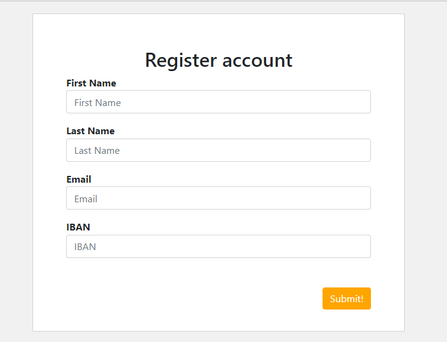

# Registration Form (React, Redux)

## Summary

When a user opens a page he or she sees the Registration Form as below:  



### Deatils
- The specific input data will be validated when the field loses the focus and when the submit button is pressed,  In case of validation errors a message will be displayed next to the invalid field. 
- Below the form, we have shown the current content of all fields simultaneously as the fields are changed in the form.
- After submission, a notification message will be spawned over the top of the form (like: Congratz! All data is valid) and then it will be hidden after 3 seconds!

##### Validation rules
- All fields are mandatory (required)
- firstName - should contain only small and capital letters, no numbers, special characters, etc.
- lastName - same as the firstName
- email - must be a valid email address
- IBAN - I used asynchronous validation to validate the IBAN, as the server is not stable - so it will fail from time-to-time

### Get it running
Below are the steps to get it running.

 - Install all the dependences in the application by using the command ``` npm install ```
 - Express server is used to validate the IBAN, hence start the server in seperate terminal by using command `` npm run start:server ``
 - Then start the application in another terminal by using command ``` npm start ```
 - Run the tests using command ``` npm test ```
